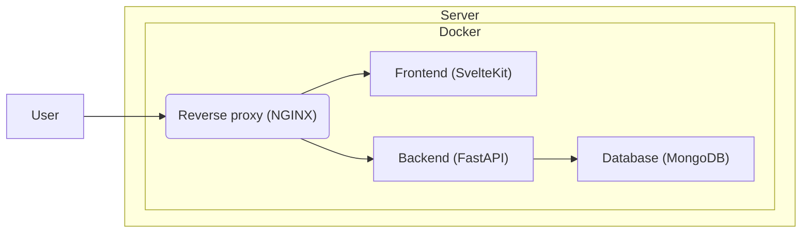

# Token App

Reward your team with tokens for the work done

## Features

- **Closed system** - only system administrators can create new accounts
- **Rewards** - system administrators can award tokens to any user
- **Transfers** - any user can transfer a token to any other user
- **An honest system** - any user can see the entire transaction history
- **Leaderboard** - users can see the number of tokens from all other users
- **Localization** - available in two languages: English and Russian

## Installation

Requirments:

- [Git](https://git-scm.com/)
- [Docker](https://www.docker.com/)

Clone this repo

```bash
git clone https://github.com/ArtemChuban/tokenapp.git
```

Goto cloned directory

```bash
cd tokenapp
```

Copy `.env` file

```bash
cp .env.example .env
```

Build and up all containers

```bash
docker compose up -d --build
```

## HTTPS

If you want to secure requests via HTTPS do this steps.

Change your email and domain name in `.env` file.

Execute this commands (You can find info in this [article](https://leangaurav.medium.com/simplest-https-setup-nginx-reverse-proxy-letsencrypt-ssl-certificate-aws-cloud-docker-4b74569b3c61))

```bash
docker compose up --build nginx
docker compose -f docker-compose-le.yaml up --build
```

After that change environment variable `MODE` in `.env` file from `local` to `production` and run all containers again

## Architecture overview


