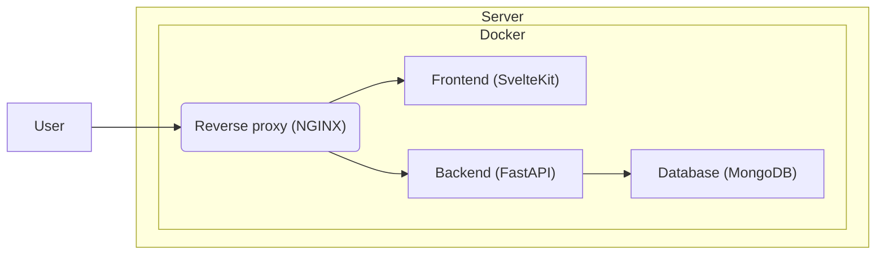

# Do Not Disturb

## Overview



## SSL certificate

To create an SSL certificate, run this commands first[^1]

```bash
docker compose up --build nginx
docker compose -f docker-compose-le.yaml up --build
```

## Build

```bash
docker-compose build
```

## Startup

```bash
docker-compose up -d
```

## Shutdown

```bash
docker-compose down
```

[^1]: [Reference](https://leangaurav.medium.com/simplest-https-setup-nginx-reverse-proxy-letsencrypt-ssl-certificate-aws-cloud-docker-4b74569b3c61)
